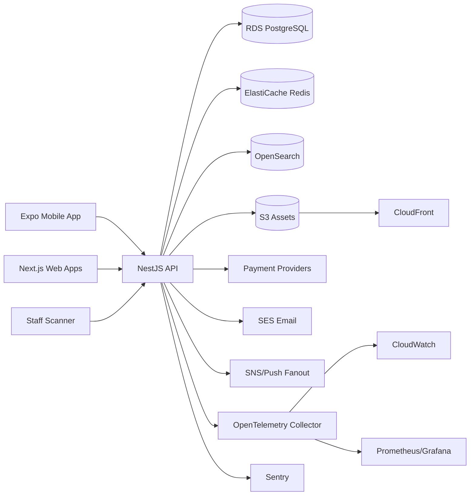

# RoamFit System Architecture

## 1. Architectural Style

RoamFit starts as a NestJS modular monolith with strict domain boundaries and evolves toward microservices only when operational data proves extraction is needed. Each bounded context owns controllers, application services, domain services, repositories, events, DTOs, and policies.

## 2. Bounded Contexts

| Context | Responsibilities | Future extraction trigger |
| --- | --- | --- |
| Identity & Access | OAuth/OIDC, JWT, refresh tokens, MFA, RBAC, devices, sessions | High auth throughput or regulatory isolation |
| Member Experience | profiles, goals, favorites, passport, activity | Personalization workloads grow independently |
| Facility Marketplace | facilities, categories, amenities, equipment, services, media, search indexing | Search/read load dominates write workload |
| Credits & Payments | packages, purchases, transactions, credit ledger, provider adapters | Financial compliance or provider complexity |
| Check-ins & Fraud | QR tokens, validation, redemptions, geofencing, fraud events | QR validation needs global low-latency edge service |
| Rewards & Engagement | FitPoints, streaks, levels, challenges, reward redemptions | Gamification events require stream processing |
| Reviews & Moderation | verified reviews, flags, media, admin moderation | Moderation workflow becomes ML-heavy |
| Notifications | push, email, in-app, templates, preferences | Volume requires dedicated queue workers |
| Admin & Analytics | settings, approvals, payouts, audit logs, operational dashboards | BI warehouse and admin scale diverge |

## 3. Runtime Components

## 4. Data Flow: Check-in

1. Member selects facility and requests a check-in token.
2. API verifies account status, facility status, credit balance, device trust, location claim, and risk score.
3. API creates a short-lived signed QR challenge in Redis with nonce, device ID, member ID, facility ID, geofence claim, expiry, and replay status.
4. Staff scans the rotating QR code.
5. API validates token signature, nonce, expiry, replay status, staff-facility assignment, business validity, device integrity, and geofence confidence.
6. API redeems credits in a PostgreSQL transaction, writes check-in, credit ledger debit, audit log, fraud signals, passport updates, streak events, and rewards events.
7. Member is prompted to record trained muscle groups after the verified visit.

## 5. Data Stores

- PostgreSQL: transactional source of truth with soft deletes, optimistic versioning, tenant-ready ownership columns, and audit log references.
- Redis: rate limits, QR challenges, idempotency keys, session revocation, hot settings cache.
- OpenSearch: facility discovery, filters, geospatial queries, typo-tolerant text search.
- S3 + CloudFront: facility photos/videos, review photos, documents, export files.

## 6. Integration Principles

- External payment and notification providers are adapters behind domain ports.
- Provider callbacks are idempotent and reconciled with internal transactions.
- Domain events are recorded in transaction and later dispatched by workers.
- APIs are versioned under `/api/v1` and documented with OpenAPI.
